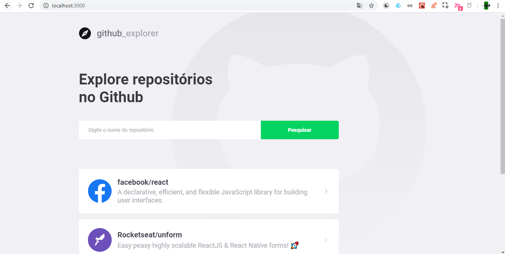
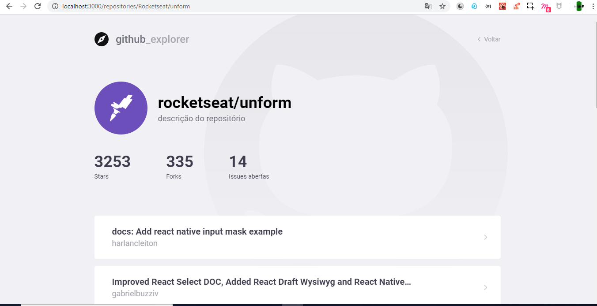
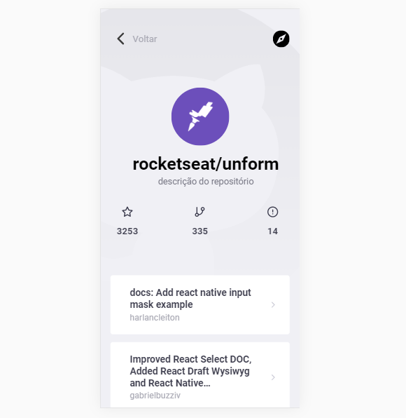

PT-BT
Versão responsiva do projeto GitHub Explorer desenvolvido durante o bootcamp GoStack

Utilizei libs como: 
- styled-components
- react-icons
- polished
- axios
- react-router

EN
Responsive version of the Github Explorer project developed during the GoStack bootcamp.

Extra libs:
- styled-components
- react-icons
- polished
- axios
- react-router

**Main Page**

**Details page**

**Details page - Mobile Version**

